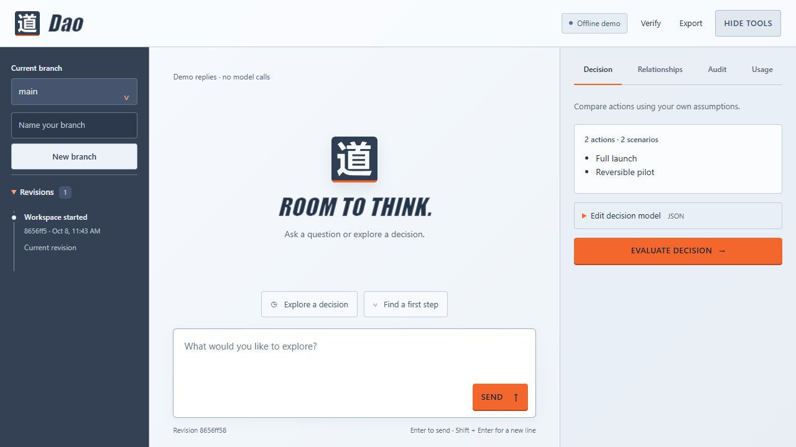

# Dao

Dao is a local conversational agent with versioned, branchable state. It saves messages, memory, decisions, audits, relationships, artifacts, and usage so you can explore alternatives and revisit earlier checkpoints. Its decision engine compares **act**, **wait**, and **abstain**, accounting for uncertainty, reversibility, and the value of additional information.

Dao starts in an **offline demo** with deterministic replies and no model calls. Live AI is optional. The terminal and browser workspace both support saved state, branches, decisions, and evidence review.



## What Dao does

| Capability | Purpose |
| --- | --- |
| Revisions and branches | Save immutable snapshots and explore alternatives from a selected checkpoint |
| Restore | Create a new revision from an earlier checkpoint while retaining history and lifetime usage |
| Decision engine | Compare actions using explicit scenarios, probabilities, payoffs, costs, reversibility, and possible observations |
| Relationship graph | Separate assessed beliefs from reported observations and track persistent conflicts |
| Audit as adjudication | Review submitted evidence under an explicit policy and record a verdict |
| Artifacts | Save named content in the database when the current audit and relationship state permit it |
| Usage accounting | Reserve tokens before requests and account for usage across branches, restores, and failed calls |

The option value of waiting comes from the supplied observation model: Dao evaluates how new information could change the best available action, then accounts for waiting, observation, and delay costs. Recorded reconsideration conditions do not schedule future work.

## Run from source

Use **Python 3.11 or newer**. The offline demo needs no runtime dependencies or API key.

```sh
git clone https://github.com/Virgo-3/Dao.git
cd Dao
python -m dao
```

Open **http://127.0.0.1:8765**. To start the terminal instead:

```sh
python -m dao --terminal
```

State is saved in `.dao/state.sqlite3` under the working directory. Use `--db PATH` to choose another database, `--port 9000` to change the browser port, or `--branch NAME` to select an existing terminal branch. Both interfaces share state when pointed at the same database. Optional `pip install .` installs the `dao` and `dao-terminal` commands.

## Windows executable

Download the Windows x64 ZIP from [Releases](https://github.com/Virgo-3/Dao/releases/latest), extract it, and open PowerShell in that folder:

```powershell
.\Dao.exe
```

The executable starts the terminal and includes Python. To open the browser workspace:

```powershell
.\Dao.exe --web --open-browser
```

The executable saves state in `%LOCALAPPDATA%\Dao\state.sqlite3` by default. It is unsigned; the release includes `SHA256SUMS` for checksum verification. See the [Windows guide](docs/windows.md) for download, verification, and build instructions. The [Windows workflow](https://github.com/Virgo-3/Dao/actions/workflows/windows-build.yml) provides builds from the latest source.

## Try a branch

In the terminal, type a message to converse, then try:

```text
/remember approach=Prefer reversible experiments
/decide
/branch experiment
/history
/switch main
/usage
/verify
```

`/branch experiment` creates a branch from the viewed checkpoint. Subsequent changes stay on that branch. `/restore ID_PREFIX` restores a reachable earlier checkpoint as a new revision. `/help` lists commands; `/quit` exits. See the [terminal guide](docs/terminal.md) for decision, relationship, audit, and artifact JSON imports.

In the browser, use **Decision** to edit a scenario model, **Relationships** to assess beliefs and record observations, **Audit** to review evidence, and **Ledger** to inspect usage, memory, and artifacts.

## Enable live AI

Dao supports the OpenAI Responses API. Set process environment variables before launch:

```powershell
$env:DAO_PROVIDER = "openai"
$env:OPENAI_API_KEY = "your-own-key"
python -m dao --terminal
```

On macOS or Linux:

```sh
export DAO_PROVIDER=openai
export OPENAI_API_KEY=your-own-key
python -m dao --terminal
```

Use `DAO_MODEL` to select a Responses API model available to your account. See [.env.example](.env.example) for all settings; Dao does not load `.env` files automatically.

Live inference sends the current conversation, saved memory, and relationship context to OpenAI with `store=false`. The API key is used for authentication and excluded from Dao's public configuration, saved state, and exports. Model requests have bounded token reservations and a read-only decision tool. The default lifetime token budget is **100,000**; configure `DAO_TOKEN_BUDGET` to change it. Optional input and output rates enable estimated dollar accounting. Estimates are not provider invoices, and offline demo token counts are estimates with zero monetary cost.

## How to interpret results

Decisions depend on the scenarios and probabilities you supply. Relationship transition estimates describe reported associations. Coherence and coverage should be read together; coherence is **Not defined** when there is no positive or negative weight to compare.

Unresolved severe conflicts exclude their declared actions from decision calculations. Changing a belief alone leaves a conflict open. Resolution requires fresh evidence review bound to the current relationship state. An audit verdict records whether submitted evidence meets the policy; source reliability and factual truth are not independently verified. Contradicting evidence prevents approval.

Dao is a single-user application bound to `127.0.0.1`. Artifacts are content saved in its database; the model has no tools for shell execution or external actions. Restoring state cannot undo external actions. Hash-linked history supports consistency checks and does not authenticate changes against the database owner. See [security boundaries](SECURITY.md) for the trust model.

## Documentation and development

- [Project guide](docs/overview.md)
- [Terminal commands](docs/terminal.md) and [Windows instructions](docs/windows.md)
- [Relationships and conflict resolution](docs/relationships.md)
- [Decision model](docs/decision-model.md) and [mathematical checks](docs/mathematical-checks.md)
- [Architecture](docs/architecture.md) and [security boundaries](SECURITY.md)

Run the Python tests and browser JavaScript syntax check:

```sh
python -m unittest discover -s tests -v
node --check dao/static/app.js
```

Node is only needed for the syntax check. GitHub Actions runs tests on Windows and Linux, and a separate workflow builds and smoke-tests the Windows executable. Provider tests use synthetic responses; live inference and provider billing require separate verification.

Dao is available under the [MIT license](LICENSE).
