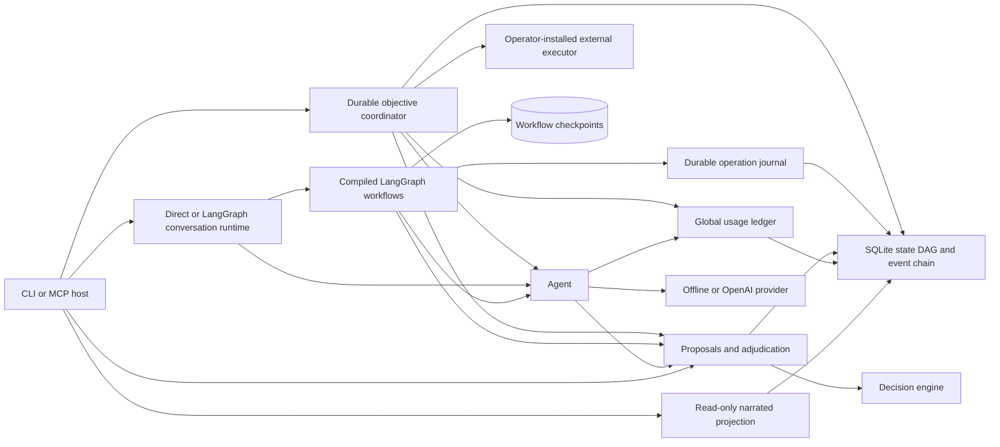

# Architecture

`Coordinator` gives the system one advancing objective lifecycle. Work revisions,
input IDs, provider operations, proposals, execution receipts, and global usage
share a work identity. A bounded run advances until review, evidence, input,
reconciliation, or completion is needed. Source-specific wait conditions wake
reassessment without authorizing an action. Completion requires exact memory
predicates or an explicit trusted outcome certification. The history survives
branch restore; completion evidence identifies its original state cut.

Local effects and their work outcomes commit atomically. Provider dispatch claims
and work transitions also commit together before the provider is called outside
the transaction. External effect proposals bind executor arguments, service
preconditions, and budget. Authorization is frozen at the atomic dispatch claim;
subsequent branch changes cannot undo a physical effect. Executor reconciliation
is a read-only inspection of the original key, never a resend. Unknown outcomes
retain liability. Quiescent operator recovery is explicit and recorded. See the
[work guide](work.md) for contracts and supported executors.

`Store` owns a SQLite connection, a reentrant process lock, and nested transactions
with savepoints. Outer writes use BEGIN IMMEDIATE. Branch updates compare the
observed head before changing a reference. Commits contain complete finite JSON
snapshots and their parent IDs. Merge compares both snapshots to a unique maximal
common ancestor and reports conflicts instead of choosing silently.

`Audit` binds decision evidence and a memory patch to a committed snapshot. An
execution rechecks the latest ruling, branch base, and integrity within the same
transaction that applies the patch and records the result. Rulings and executions
are append-only. The event chain covers proposals, rulings, executions, branch
operations, and ledger changes. Proposals and ledger projections are operational
tables, so database administration remains a trusted capability.

`Ledger` uses physical global accounting separate from logical branch snapshots.
Reservations prevent simultaneous calls from consuming the same remaining
budget. Known results settle exactly once. Ambiguous results retain liability.
An actual overrun must be recorded even when it exceeds the admitted amount.
No provider call occurs inside a SQLite transaction, avoiding long database locks.

`Agent` snapshots the selected branch, records a user message, calls its provider,
and settles usage before attaching the answer. A changed head makes the answer
orphaned while preserving its usage. Provider tool calls can inspect memory or
create one pending local-memory proposal. They cannot rule on or execute it.

`MCP` exposes a local stdio interface. Adjudication is omitted by default and
requires deliberate trusted-host configuration. State branch operations are
operator capabilities and can mutate local state without passing through the
external-action proposal pipeline. A host with database or filesystem access
already has broader authority than this interface.

`Projection` reads a consistent database cut and turns the selected branch's
snapshot plus durable operational records into a source-linked narrative. It
does not call a provider or write state. The output identifies the branch head
and event sequence, with counts and omissions so bounded prose cannot be
mistaken for a complete replay. A projection can be regenerated; it carries no
adjudication or execution authority.

`LangGraph` owns scheduling, checkpoint progress, streaming, and interrupts.
The optional adapter returns native compiled chat and action graphs. Its
checkpoints carry workflow inputs, references, and receipts; they cannot replace
Dao branch snapshots, adjudications, or accounting. CLI and MCP conversation
can select this runtime without changing the Agent reply interface. The action
graph records a local proposal, interrupts for independent review, then reads
the latest Dao ruling on wakeup. Resume data has no approval authority. Approved
execution goes through the existing atomic `Audit.execute` checks.

`WorkflowJournal` bridges the two persistence boundaries. Local proposal creation
and its saved receipt share one Dao transaction, so replay after a missed graph
checkpoint cannot duplicate the proposal. Chat operations are claimed before
dispatch and successful replies are recorded for replay. An incomplete or failed
chat claim prevents automatic provider retries; an operator must inspect state
and reconcile uncertain usage before explicitly starting a new operation. The
journal does not promise exactly-once external calls. LangGraph checkpoint
rewind leaves Dao state and global usage unchanged. See the
[integration guide](langgraph.md) for APIs, recovery, and the restart demo.

## Invariants

1. State commits and audit events cannot be edited through normal store APIs.
2. A stale expected head never overwrites a newer branch state.
3. An action executes once, after approval, against the exact reviewed base.
4. Restoring logical state preserves physical spend and adjudication history.
5. Unknown billing liability stays reserved until explicit reconciliation.
6. Waiting earns value only from the supplied signal model after its cost.
7. Model-generated utility estimates and configured USD prices remain inspectable
   assumptions; neither is presented as observed truth.
8. Rendering a projection cannot change branch state, audit records, or usage.
9. Graph checkpoint or resume data cannot adjudicate a proposal, rewind Dao
   state, or erase usage. Replayed local operations use durable Dao receipts.
10. Restoring a snapshot cannot rewind work revisions or erase dispatched effects.
11. Work progress cannot certify completion from provider prose or approve itself.
12. External dispatch and budget admission share a transaction; ambiguous effects
    stop for reconciliation and are never automatically resent.

## Extension points

Implement a provider with `reservation_usd` and `respond(messages, tools) -> Reply`.
Dedicated external executors should reconcile side effects across crashes, record
an external idempotency key before dispatch, and provide compensation where real
reversibility exists. Add authenticated actors and independent adjudicators
before offering a shared or networked service. Checkpoint event-chain roots to a
separate signed store if an adversarial database administrator is in scope.

Snapshot restoration means restoring a past state, not selectively undoing one
historical edit. Divergent conversation arrays require explicit resolution.
The decision model handles a single evidence step; it does not schedule waiting,
collect signals, or model changing action availability automatically.
