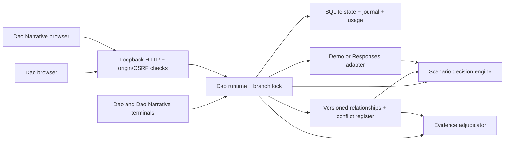

# Runtime architecture

Dao and Dao Narrative are separate applications over this runtime. Their fixed entry points select their HTML, script, terminal wording, and examples. CSS, Hanzi branding, live provider instructions, storage schema, decision evaluation, evidence policy, and accounting are shared. Each application creates its own runtime and uses its own default database and browser port; only an explicit `--db PATH` makes them share a database.

`dao_narrative.app.NarrativeDao` overrides presentation and demo examples. `dao_narrative.terminal.NarrativeTerminal` supplies writing labels and help to the same terminal command implementation. Neither application has an interface selector.

The model generates replies and may request read-only decision evaluation. The runtime controls branches, audit permissions, and usage accounting. It alone saves revisions and records model and tool attempts.

## Turn lifecycle

1. Validate input/context, acquire a branch lock, and check the expected head.
2. Commit the user message. A concurrent write through another process must still pass SQLite's optimistic compare-and-swap.
3. Execute an explicit local command or reserve a model request against the global lifetime token budget. Journal every admitted request before calling the provider.
4. Stream deltas. For a decision tool call, validate its input and preserve the result. A follow-up model request requires its own reservation. Three provider requests is the turn limit.
5. Finalize each admitted request exactly once using provider usage, or retain the reservation as an estimated unknown charge after failure. On browser disconnect, continue the bounded request to completion so usage is recorded.
6. Commit the complete assistant response or a labeled failed partial response. Failed partial responses remain inspectable and are excluded from subsequent model input.

Each provider request is limited to 4 MB of decoded body data, 50,000 SSE lines, and 2 MB per line. Empty text deltas are ignored, non-string deltas are rejected, and a running character counter bounds accumulated output without repeatedly scanning prior chunks. The reader stops at the first terminal response. It checks a 90-second elapsed deadline between decoded transport reads, with a separate 15-second socket-stall timeout; synchronous transport operations can delay a deadline check. Limit failures use the same conservative usage accounting as other interrupted streams.

Decision evaluation uses the same limits for HTTP and model inputs: at most 64 entries per array, 200 characters per name, and 250,000 action-scenario evaluations across the prior and all signals. Work above that budget is rejected before scoring. Each provider response may request at most one tool call; multiple calls fail before any evaluation, bounding aggregate work across the three rounds. Model tool rejection is journaled and returned as a diagnostic; it cannot bypass the computation limits after a stream finishes.

The database uses per-operation connections and immediate write transactions. Snapshot insertion, head movement, and the corresponding hash-linked journal event are atomic. Usage reservation/finalization and their journal entries are also atomic. The full turn spans multiple transactions deliberately, preserving a durable user turn and usage evidence if the process stops midstream.

## State and persistence

A revision contains `messages`, `memory`, `decisions`, `artifacts`, and optional `audits` and `relationships`. Older snapshots without relationships read as an empty graph without rewriting historical hashes. Relationship operations use the same branch lock, optimistic head check, and atomic revision journal as other mutations. A revision's identifier hashes its parent, kind, label, full snapshot, and UTC timestamp. A branch's head points to its latest revision; a checkpoint is the revision being viewed or selected. Restore copies a reachable ancestor's snapshot into a new revision, preserving history and lifetime usage. It cannot undo external actions.

The global journal links events across all branches with SHA-256. Integrity verification recalculates revision/event hashes and replays branch heads, metadata, and ledger entries, then checks SQLite integrity. Verification is performed before startup. It detects inconsistent local edits and missing middle records, not an adversary who can replace every hash or a consistent historical suffix.

An export is a readable branch snapshot plus ancestry, branch events, configuration without credentials, and the lifetime ledger. It is not a complete database backup or an import format. For disaster recovery, stop Dao cleanly before copying `.dao/state.sqlite3`; never assume copying a live WAL database's main file alone captures recent writes.

## Policy and trust

Audit claims for artifacts take the form `artifact:<trimmed-name>:<SHA256(trimmed-content)>`. The latest stored verdict for the exact claim must be allowed and its identifier must match the supplied identifier. The verdict must have no action scope and must bind the current relationship graph digest. A graph edit or a newer contradiction requires a new audit. Saving also requires no unresolved severe conflicts anywhere in the graph. Older verdicts without a relationship digest require a new audit. Creating a branch or restoring a checkpoint can deliberately recover prior policy state; this is an explicit operator choice, and journal history remains available.

Relationship beliefs assign probabilities to positive, neutral, and negative outcomes, or are explicitly unknown. Reported observations remain separate from assessed beliefs. Conditional coherence is positive mass divided by positive plus negative mass; it displays **Not defined** when that denominator is zero. Assessed coverage and unknown weight show missing assessments. Relation scope and weights are fixed once saved. Any negative belief probability or reported negative before/after state opens or reopens a conflict. Resolution requires a current graph-bound audit verdict, a belief with zero negative probability, and no latest negative reported outcome. Transition estimates use a symmetric Dirichlet prior and show counts, posterior means, and variances per relation, action, and context. They describe reported associations and do not automatically supply calibrated causal probabilities. See [relationships](relationships.md).

The service binds unresolved severe conflicts to operator-declared exact action names and removes affected actions from both immediate and signal-conditioned choices. An empty applicability list applies globally. Coherence and transition summaries accompany results, but do not replace the caller's utilities. Saved memory and relationship context are sent as untrusted user input; fixed developer instructions describe the runtime boundary, following [official OpenAI guidance on untrusted inputs](https://developers.openai.com/api/docs/guides/agent-builder-safety).

Source labels, evidence reliability, scenario probabilities, and utilities are supplied by the operator. Decision results are recommendations based on those assumptions and do not perform external actions. Audit verdicts gate conflict resolution and local artifact saving.

## Source map

| File | Responsibility |
| --- | --- |
| `dao/store.py` | Revisions, branches, journal, usage reservations, integrity |
| `dao/service.py` | Turn lifecycle, branch locks, commands, artifact permission |
| `dao/decision.py` | Validated decision problem, posterior utility, waiting |
| `dao/audit.py` | Deterministic evidence review, verdicts, and digest |
| `dao/relationships.py` | Relationship beliefs, persistent conflicts, and transition estimates |
| `dao/provider.py` | Demo and live model streams; bounded read-only tools |
| `dao/server.py` | Loopback JSON/NDJSON API and static assets |
| `dao/config.py` | Server-side configuration and cost accounting |
| `dao/static/` | Accessible dependency-free browser workspace |
