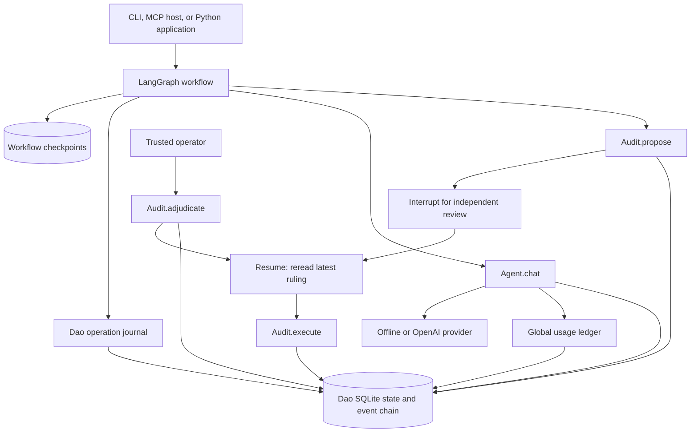

# Dao with LangGraph

LangGraph schedules durable workflows; Dao owns their meaning and authority.
The integration returns native compiled `StateGraph` instances, so the same
agent can participate in graph composition, streaming, and checkpointed
execution while retaining Dao's branch, audit, and usage rules. The core remains
usable without LangGraph installed.



Checkpoint history and Dao's state DAG serve different purposes. A checkpoint
remembers workflow progress, inputs, references, and receipts. A Dao commit is
the authoritative branch snapshot. Loading an older checkpoint does not restore
Dao memory, clear a ruling, or refund provider spend. Use Dao's explicit branch
and revert operations to change its logical state.

## Install and run

```sh
python -m pip install -e ".[langgraph]"
python examples/langgraph_demo.py
```

The optional extra uses LangGraph's v1 API (`langgraph>=1.0,<2`) and the v3
SQLite checkpoint package (`langgraph-checkpoint-sqlite>=3,<4`).

The offline demonstration uses separate SQLite files for Dao and LangGraph. It
records one conversation turn, proposes a memory patch, pauses for review, writes
an independent ruling, closes both database connections, and recompiles the graph
from persisted checkpoints before resuming. Assertions check the resulting
memory, saved chat receipt, unchanged usage on replay, and audit integrity. No
credentials or network calls are required.

The CLI and MCP use the same Agent interface with the graph runtime enabled:

```sh
dao --db .dao/state.db chat --runtime langgraph --checkpoint-db .dao/checkpoints.db
dao --db .dao/state.db chat --runtime langgraph --checkpoint-db .dao/checkpoints.db --json "Hello, Dao."
dao-mcp --db .dao/state.db --runtime langgraph --checkpoint-db .dao/checkpoints.db
```

Add `--provider openai` for a configured live provider. Both entry points default
to the direct runtime. Without `--checkpoint-db`, the graph runtime uses the Dao
database path plus `.checkpoints.db`, for example `.dao/state.db.checkpoints.db`.
It assigns a separate checkpoint thread and run ID to each turn. Replies retain
their usual `text`, `head`, and proposal fields and add a `workflow` object with
the `run_id`, `thread_id`, and `operation_id` needed for inspection.

For retry-safe one-shot CLI chat, choose `--run-id TURN_ID`. Repeat the identical
message, branch, and ID to retrieve a completed receipt; this option is not for
interactive chat. `--expected-head HEAD` can bind the initial turn explicitly.
The MCP `chat` tool accepts the same optional `run_id` and `expected_head` fields.
When an entry-point retry omits `expected_head`, the runtime uses the original
operation's head rather than silently treating the retry as a new turn.

## Conversation graph

```python
import uuid

from langgraph.checkpoint.sqlite import SqliteSaver

from dao.agent import Agent
from dao.langgraph import compile_chat_graph
from dao.store import Store

store = Store(".dao/state.db")
try:
    with SqliteSaver.from_conn_string(".dao/checkpoints.db") as checkpointer:
        graph = compile_chat_graph(Agent(store), checkpointer=checkpointer)
        result = graph.invoke(
            {
                "run_id": uuid.uuid4().hex,
                "text": "Hello, Dao.",
                "branch": "main",
                "expected_head": store.head("main"),
            },
            config={"configurable": {"thread_id": "my-conversation"}},
            durability="sync",
        )
        print(result["reply"]["text"])
finally:
    store.close()
```

`compile_chat_graph(agent, *, checkpointer)` wraps `Agent.chat`; its `reply` is
the existing Agent reply object. Chat may return a memory proposal, but it does
not adjudicate or execute one. Use `stream(..., stream_mode="updates")` to observe
node updates. The graph also exposes native async APIs; choose an async-capable
checkpointer such as `AsyncSqliteSaver` when using them. `SqliteSaver` is for
synchronous invocation and streaming.

Every new turn needs a new `run_id` and the branch's current `expected_head`.
Retrying a completed operation with the same input and `run_id` returns its saved
receipt, including its original head; that receipt is not a read of current
state. Reusing that ID with different input is an error. `thread_id` names the
LangGraph checkpoint history and must be a nonempty string. It is separate from
`run_id`, the Dao operation identity, and `branch`, the Dao state reference.

## Action graph and independent review

`compile_action_graph(store, *, checkpointer)` accepts:

| Input | Meaning |
| --- | --- |
| `run_id` | Stable, unique identity for this action workflow |
| `problem` | Explicit decision model accepted by Dao's decision engine |
| `patch` | Local memory changes accepted by `Audit.propose` |
| `expected_head` | Current head of the branch before recording the proposal |
| `branch` | Dao branch; defaults to `main` |
| `rationale` | Optional explanation recorded with the proposal |

The proposal node records the decision and patch once. An unruled `act`
recommendation then reaches a LangGraph interrupt. The pause includes
`proposal_id`, `base`, `branch`, and the recommendation; the output also exposes
the full `proposal`.
Memory has not changed at this point. A `wait` or `abstain` recommendation ends
without executing the memory patch; this graph does not collect evidence.

A trusted operator reviews and adjudicates the proposal through `Audit` or the
existing CLI:

```sh
dao --db .dao/state.db proposals
dao --db .dao/state.db adjudicate PROPOSAL_ID approved --actor operator --reason "Reviewed exact memory patch"
```

Wake the same graph checkpoint after that separate action:

```python
from langgraph.types import Command

result = graph.invoke(
    Command(resume=True),
    config={"configurable": {"thread_id": "the-original-action-thread"}},
    durability="sync",
)
```

The resume value carries no approval authority. The graph reads the latest Dao
ruling: missing or deferred rulings interrupt again, rejection ends the workflow,
and approval proceeds through `Audit.execute`. That execution atomically checks
the current branch head, proposal digest, latest ruling, and integrity before
applying the patch. Its result appears in `execution` with `status="executed"`.
A newer ruling supersedes an older approval. A changed branch invalidates the
reviewed base and requires reassessment with a new proposal.

Keep a pending action's checkpoint thread dedicated to that operation. Resume
it with `Command(resume=...)`; do not send a different operation as fresh input
to the same pending thread. Native LangGraph accepts new input as a new run,
replacing the active checkpoint request. Recording its new proposal also advances
Dao's branch head, invalidating the earlier proposal. Use a separate `thread_id`
for a distinct pending action and account for branch-head conflicts explicitly.

The action graph is a Python workflow API. Existing `dao adjudicate` and
`dao execute` commands remain available. Action graph start/resume are Python
APIs; `dao workflow` inspects receipts. Graphs can be used as nodes in a larger
LangGraph workflow, with their declared input/output channels mapped at that
boundary. Give every distinct
operation a fresh ID and preserve its exact original inputs when replaying it.

## Durability and recovery

LangGraph interrupts restart their node when resumed. Dao's operation journal
makes local proposal creation atomic with its receipt in the Dao transaction,
and `Audit.execute` is already idempotent by proposal ID. A crash between a local
write and the next graph checkpoint therefore does not create another proposal
or execute the same patch again.

Provider calls cross an external boundary. The chat journal claims an operation
before dispatch and saves a successful receipt afterward. A completed receipt
can be replayed safely. An incomplete or failed operation stops rather than
automatically attempting the provider call again. There is no exactly-once
provider-call guarantee, and the adapter configures no automatic retries.
Inspect Dao state, audit history, and usage before initiating a new turn. If a
provider attempt has uncertain billing, establish the actual usage independently
and reconcile its request through `dao resolve-usage`; then explicitly start a
new operation against the current head. Resuming a checkpoint does not resolve
unknown usage or authorize repeating an incomplete operation.

```sh
dao --db .dao/state.db workflow OPERATION_ID
dao --db .dao/state.db state
dao --db .dao/state.db log
dao --db .dao/state.db events
dao --db .dao/state.db usage
dao --db .dao/state.db verify
```

Use the `operation_id` reported in the reply's `workflow` metadata. The workflow
inspection command shows the durable operation record; `verify` also checks
workflow receipts against their event-chain records when a journal exists.
Do not clear or reset the journal to force a retry.

Keep the Dao database and checkpoint database together when recovering a
workflow, and use the same store, `thread_id`, and operation inputs. SQLite
checkpoint persistence survives connection and process restarts. The examples
and CLI/MCP runtime use `durability="sync"` to persist each checkpoint before
the next graph step.
`InMemorySaver` is suitable for tests and short experiments but cannot resume
after a process restart. The graph factories require an explicit checkpointer;
choose its durability deliberately. Protect both files with OS permissions:
workflow inputs and replies may contain sensitive data.

This remains a local, single-operator system. SQLite head guards reject competing
state changes; workflow scheduling does not provide shared-service identities,
authorization, or cross-service transactions. The implemented effect is a local
memory patch. External actions require their own approved executors, idempotency
keys, reconciliation, and compensation.

The integration follows the official LangGraph documentation for
[graph composition](https://docs.langchain.com/oss/python/langgraph/graph-api),
[interrupt and resume semantics](https://docs.langchain.com/oss/python/langgraph/interrupts),
and [checkpoint persistence](https://docs.langchain.com/oss/python/langgraph/persistence).
