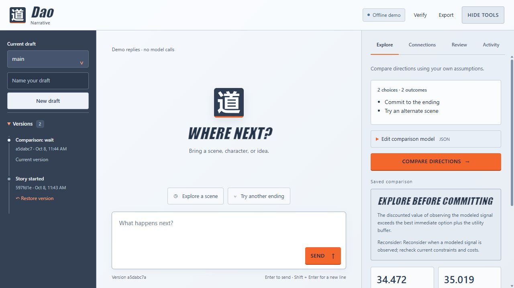

# Dao Narrative

Dao Narrative is a separate writing application. It keeps the cleaned writing interface: drafts, saved versions, story notes, Explore, Connections, Review, and Activity. Dao remains the general-purpose application. There is no interface selector inside either app.



## Launch

```sh
python -m dao_narrative
python -m dao_narrative --terminal
```

The browser defaults to **http://127.0.0.1:8766**. After `pip install .`, the equivalent commands are `dao-narrative` and `dao-narrative-terminal`.

On Windows, extract the separate Dao Narrative ZIP and run:

```powershell
.\DaoNarrative.exe
.\DaoNarrative.exe --web --open-browser
```

The app starts with deterministic offline demo replies. The shared `DAO_*` and `OPENAI_API_KEY` environment settings can enable live AI; neither app loads `.env` automatically. The live model instructions, tool permissions, numerical decision rules, and evidence policy are shared. The writing examples and interface wording do not create new model abilities or determine canon.

## Saved work

Source launches use `.dao-narrative/state.sqlite3`. The executable uses `%LOCALAPPDATA%\DaoNarrative\state.sqlite3`. Dao uses separate defaults: `.dao/state.sqlite3` and `%LOCALAPPDATA%\Dao\state.sqlite3`.

Existing writing work in an earlier Dao database stays where it was saved. Open it deliberately with `--db PATH`; the launcher does not copy, move, migrate, or relabel stored history. Both applications understand the same database and `dao-export-v1` schema. If explicitly pointed at one database, they share its revisions, branches, artifacts, and lifetime usage. Each app's terminal and browser also share state when given the same path.

## Terminal commands

| Command | Purpose |
| --- | --- |
| `/drafts`, `/draft NAME`, `/switch NAME` | List, create, or switch drafts |
| `/version`, `/versions`, `/restore ID_PREFIX` | Refresh, inspect, or restore saved versions |
| `/notes`, `/remember KEY=VALUE` | Read or save story notes |
| `/connections`, `/conflicts`, `/connect PATH` | Inspect connections or apply one operation JSON |
| `/explore`, `/explore PATH` | Compare the story example or a supplied decision model |
| `/review PATH`, `/manuscript PATH` | Review a claim or save content with its matching verdict |
| `/activity`, `/verify`, `/export PATH` | Inspect usage, verify integrity, or export saved work |

`/help`, `/quit`, and `/say TEXT` work as in Dao. Original command names remain compatible aliases. JSON imports keep the same fields and the 128 KiB bound described in the [terminal guide](terminal.md).

Comparisons depend on the numerical assumptions you supply; they do not score literary quality. Reviews check supplied sources under the shared evidence policy and do not decide canon. Saving a manuscript requires an allowed review bound to the exact name, content, and current relationship state, without an action scope or unresolved severe conflicts. Restore preserves history and lifetime usage.

## Build

```powershell
python scripts/build_windows.py --app narrative
python scripts/smoke_windows.py dist/windows-narrative/DaoNarrative.exe --app narrative
```

The [Windows workflow](https://github.com/Virgo-3/Dao/actions/workflows/windows-build.yml) builds and tests both apps independently. See [Windows instructions](windows.md) for checksums and packaging details.
