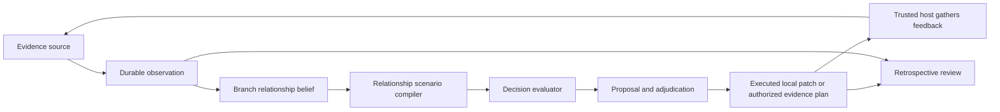

# Telos-inspired experience layer

Dao can use relationship evidence to inform a decision while keeping its existing
authorization, branch history, and usage accounting. This layer is a practical
interpretation of the user's Telos material. It does not assert that software has
subjective experience or give the material authority over a user's goals.

## The records and their meanings

An **observation** records what a named source reported, its claimed event time, and
which relationship and outcome dimension it concerns. The observation is durable
across branches. It is evidence, not proof that the reported outcome occurred or
that the relationship is generally helpful. Corrections require another record;
they do not silently edit the original.

A **relationship belief** is Dao's branchable interpretation of that evidence.
It distinguishes `enhancing`, `neutral`, and `degrading` possibilities. A neutral
state means little effect in the model. Uncertainty means the effect is not
known. Neither is the same as choosing to wait. Separate relationships or
dimensions are needed when an action helps one participant and harms another.

An **experience trail** can connect an executed proposal to later observations
and a review. Observations can name a proposal; a review refers to an executed
proposal and observation IDs. The original decision retains its prediction,
while the later record preserves what was reported afterward. Usage remains in
the global ledger. Reverting a branch can restore an earlier internal
interpretation, but cannot erase a report, refund spending, or undo an external
consequence.

## Decision path

The relationship compiler turns an explicitly modeled relationship into the
static scenario format used by Dao's existing one-step evaluator. Each
candidate action must supply a utility for all three possible relationship
states; the state names do not imply utility. Signal likelihoods, action
utilities, and belief probabilities remain assumptions that need a stated
source and calibration. The operator must supply goal values and hard limits
through the decision problem and policy. This compiler does not authenticate
their approval. A model's predicted benefit cannot supply its own permission.
Relationship-specific action proposals require an assessed prior. The uniform
placeholder created from `null` can inform inquiry, but cannot authorize a
relationship action.

Waiting needs an evidence plan: the target relationship, source to consult,
question to answer, deadline, and maximum acquisition cost. The decision problem
separately states possible signals, their likelihoods, and the utility cost of
waiting. Permission to gather evidence does not authorize the action that might
follow it. New evidence requires a new decision against the current branch head
and current policy.
Expected-head checks prevent a stale proposal or belief update from overwriting
a newer branch state. They do not prove that the outside world stood still.

The prospective ruling asks whether an action was justified with the information
then available. A retrospective review asks how its predictions compared with
subsequent reports. These are independent judgments: an unlucky result does not
rewrite the earlier rationale, and a fortunate result does not retroactively
grant permission. `review_outcome` stores a reviewer's assessment and reason; it
does not calculate forecast accuracy or silently change policy.

## Use the local MCP tools

1. Call `read_state` to obtain the current branch head. Register a relationship
   with `register_relationship` using that `expected_head`, a subject, object,
   dimension, and either an explicit three-state prior or `null`. A `null` prior
   creates an **unassessed** uniform belief, rather than claiming neutrality.
2. Call `evaluate_relationship` with explicit action utilities for `enhancing`,
   `neutral`, and `degrading`. Optional signals must be an exhaustive likelihood
   model for one observation. The result includes the canonical decision problem
   as `inputs` and a recommendation to act, wait, or abstain.
3. If acting is recommended, call `propose_relationship_action` with the
   relationship ID, the same action assumptions, a local memory patch, and the
   latest `expected_head`. It records the relationship ID, referenced evidence,
   and reviewed head with the proposal. A trusted operator can adjudicate it;
   approved actions can then be executed against the proposal's base head.
4. If waiting is recommended, pass those `inputs` to `propose_evidence` with a
   plan containing `relationship_id`, `source`, `question`, a timezone-aware
   `deadline`, and `max_cost_usd`. Use the latest branch head as `expected_head`.
   A trusted operator may approve that evidence proposal. Calling
   `execute_action` then records an authorized plan; it does not fetch evidence
   or spend the allowed amount automatically.
5. A trusted observer can use `record_observation` to submit a reported signal,
   its likelihood under each relationship state, claimed source and actor, and
   a stable `source_event_id`. The `(source, source_event_id)` pair makes
   observation storage idempotent: repeating the same accepted request returns
   the first record; changing its content with the same pair fails. An optional
   evidence proposal ID binds the report to an executed, approved plan, target
   relationship, named source, and deadline. A trusted host may also submit an
   unplanned observation without a proposal ID. The returned observation ID is global
   and durable.
6. Call `apply_observation` with that ID and the latest branch head to update its
   belief. It applies Bayes' rule and records the new head. Applying the same ID
   twice does not count it twice. Reevaluate against the new head before any
   primary action. After an executed proposal, a trusted reviewer may call
   `review_outcome` with observation IDs and an assessment of `supported`,
   `contradicted`, or `inconclusive`.

Observation likelihoods are `P(reported signal | relationship state)`; the three
numbers for one signal need not sum to one. The compiler's **multiple** possible
signals must collectively partition each relationship state. Repeated reports
about the same underlying event may be correlated; assigning them separate IDs
does not make them independent evidence. Check their sources before applying
both.

Conditioning uses exact fractions of the supplied finite probabilities, so tiny
positive likelihoods do not become impossible evidence merely because their
unnormalized products are smaller than a float. Branch beliefs are persisted as
floats. If a positive normalized posterior cannot be represented there, applying
the observation raises a numeric-range error before changing the head, belief,
or evidence IDs. The durable observation remains available for review or retry;
no artificial probability floor or false certainty is stored.

`record_observation` is exposed only with `dao-mcp --allow-observation`.
The direct Python method also accepts a missing `source_event_id`, but callers
should supply one when a submission might be retried.
`adjudicate_action` and `review_outcome` require `--allow-adjudication`. These
flags grant capabilities to the connected local MCP host. A supplied `source`
or `actor` string is a claim, not authentication. Registration and application
also change branch state, so grant MCP access only to hosts allowed to make
those changes.

## Plan across changing relationships

`dao.temporal.plan_temporal(problem)` provides a separate, pure planning
calculation for cases where action and delay may change a relationship. Supply
`states`, an explicit probability `prior`, a finite `horizon`, and a `budget`.
Each action supplies an ID, optional `kind` (`act`, `probe`, or `hold`),
state-specific `utilities`, a utility `cost`, a separate `resource_cost`, a
transition distribution from each current state to the next state, and a
distribution of possible observations for each next state. An optional
`max_loss` limits the sum of worst possible step losses. Each probability row
must cover its full state or outcome set and sum to one.

The result gives the first action, expected value, and a conditional policy:
each possible observation has a probability, an updated belief, and a next
choice. Immediate utility is assigned using the state before an action; the
action then changes the state, and the observation describes the new state.
This timing must match the real question being modeled. Stopping early always
has zero future value. A `hold` or `probe` can be selected because of what it
preserves or reveals through later decisions; no separate option bonus is
added.

The planner identifies this calculation as `dao-temporal/2`. Probability support,
resource debits, and cumulative loss debits use exact fractions of the validated
float inputs internally. Utility scores and displayed probabilities remain
floats. The result exposes `prior_support` and each branch's `posterior_support`;
`possible: true` identifies a possible observation even if its displayed
probability rounds to zero. These support lists, rather than displayed zeros,
identify reachable states. Tie preferences are measured against a fixed maximum
and cannot drift through successive near ties. Persisting a predicted belief
uses the same support-preserving storage check as applying an observation; a
numeric-range failure leaves the reviewed head and memory patch unchanged.
Repeated exact subproblems are cached within one planning call. The returned
`expansions` counts unique evaluated subproblems, and `cache_hits` counts reuse;
the existing worst-case expansion limit still bounds accepted input models.
Each returned policy branch remains an independent JSON tree.

The read-only MCP tool `plan_relationship` supplies the chosen branch's
relationship belief as the prior and returns its `belief_head` and `evidence_ids`
with the plan. Callers supply the action utilities, transition probabilities,
and observation probabilities. Replan if the branch head changes. A plan result
alone does not alter branch state. If its first choice is an `act`,
`propose_temporal_action` can bind the same model, relationship, branch head,
and a local memory patch to an auditable proposal. Approval and `execute_action`
apply that patch and the selected action's predicted transition in one branch
commit. The resulting belief is marked as a **prediction**; it is not an
observed outcome. `probe` and `hold` choices remain planning advice, without a
matching audited temporal executor. The current evidence plan authorizes only
the static one-step information path.

After a real report, `apply_observation` updates the current branch belief
using the report's static likelihoods. It does not replay a planner's
transition model. The caller must use a likelihood model that fits the
post-action state and avoid counting the same evidence twice.

The planner accepts at most six states, eight actions, eight observation
outcomes per action, and four decision steps, with a 20,000 expansion limit.
Its budget uses the caller's `resource_unit`; it is not the provider usage
ledger. The pure planner neither creates a proposal nor executes an effect,
acquires evidence, or records spending. The caller must derive the prior from an
identified branch and evidence version, supply transition and observation
assumptions, and seek separate adjudication before any real effect. The original
one-step evaluator and relationship compiler
remain useful when acquiring one signal is modeled as leaving the hidden state
unchanged.

## Coherence and outcomes

Telos's coherence ratio is the share of enhancing relationships among enhancing
and degrading relationships. It is unavailable when both counts are zero. It
omits neutral relationships, intensity, unequal effects on people, and goal
progress. It can rise merely because a difficult relationship is removed from
the measured set. Use it as an inspectable diagnostic alongside coverage,
stakeholder outcomes, cost, and reversibility, not as the sole score to optimize.

`relationship_coherence` reports a **ratio of expected enhancing and degrading
counts** for an explicit relationship scope. Its response includes the scope IDs,
expected active count, and IDs omitted because their prior is unassessed. This
belief-based ratio is not the expected ratio over actual outcomes. When the
expected active count is zero, the ratio is `null`. Compare scope IDs between
runs: removing a difficult relationship can raise the ratio without improving
the user's goal.

Experiential intensity and provider usage measure different things. Feedback
about a person's stress or satisfaction must retain its source and uncertainty;
Dao should not infer a user's feeling as a fact from a message. Tokens, time,
and USD belong in the usage record and should not be presented as emotional
intensity.

## Trust and current scope

Observation submission and adjudication are separate capabilities. A caller's
chosen `source`, `actor`, or observation time is a claim; the record does not
authenticate the claimant or verify the time. Expose those writes only through
a trusted local host, and validate claims when integrating real external
services. The current observation record has no simulation marker, so do not
submit simulated observations as real evidence.

The current executor performs local memory patches. A branch can explore
alternative forecasts; it cannot reverse effects in another service. External
adapters would need world-state checks, idempotency, receipts, reconciliation,
and compensating actions. Evidence plans do not perform collection or charge
actual acquisition cost; the host must carry out authorized collection and
account for any cost through an appropriate adapter. The one-step evaluator
treats the hidden relational state as fixed while a signal is acquired. The
temporal planner can simulate action-dependent state changes for a small bounded
model. Only its selected first `act` has an audited local-memory executor;
planned `probe` and `hold` effects need further adapters. Coherence is a
diagnostic in the current MCP API and is not used as an action score.
